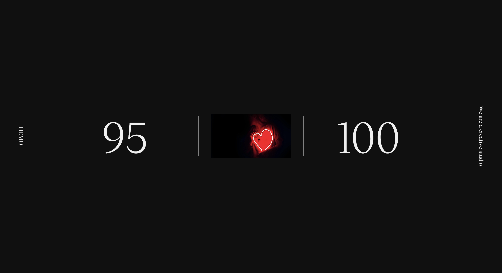

# Preloader Animation

 

## Features

- Preloader Animation
- Responsive Design
- GSAP Animations
- Easy to use

## Usage

To use this, open the `index.html` file in your web browser.

## Author

- [Farid Vatani - Software Engineer](https://github.com/faridvatani)

## Contributing

Contributions are welcome. Please feel free to fork this repository and open a pull request to add more features, fix bugs, improve documentation etc.

## Acknowledgements

This project was inspired by the "Awwwards Element" from [studiochapeaux](https://studiochapeaux.com/projekt/dreifragezeichen/).

## License

This project is licensed under the MIT License. See the [LICENSE](LICENSE) file for more details.
